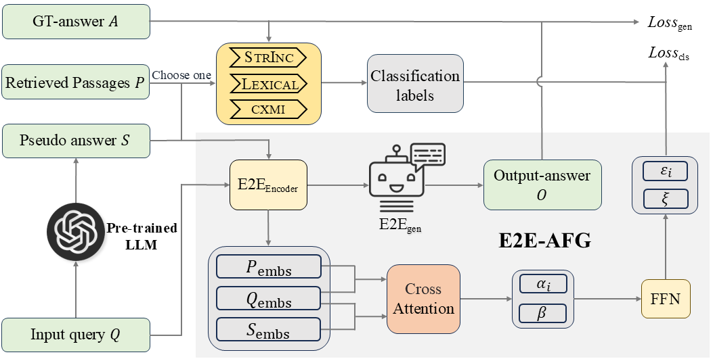

# E2E-AFG: An End-to-End Model with Adaptive Filtering for Retrieval-Augmented Generation

## Introduction
- We propose an End-to-End Model with Adaptive Filtering for Retrieval-Augmented Generation (E2E-AFG), which integrates classification and generation tasks into an end-to-end framework, allowing the model to simultaneously learn context filtering and answer generation. 
- The construction of the end-to-end model is based on the generation model, augmented with a classification module that employs a cross-attention mechanism to predict whether sentences in the context contain answers, enabling the model to answer the input query based on a certain judgment of the context.

<div style="display: flex; flex-direction: column; align-items: center; ">

</div>
<p align="center" style="margin-bottom: 10px;">
Overview of our E2E-AFG
</p>

## Install

Install all required libraries by running

```bash
conda create -n e2eafg python=3.9 -y
conda activate e2eafg
pip install -r requirements.txt
```
## Folder Structure
  ```
  E2E-AFG/
  │
  ├── multitask_train.py - main script to start training
  ├── query.py - generate answers via trained model
  ├── eval.py - evaluation of generated samples
  │
  ├── generate_pseudo_answer.py 
  ├── get_silver_label.py - obtain the silver classification label
  ├── process_inputs.py - get the input to the model
  │
  │
  ├── checkpoints/ - saved model
  │
  ├── datasets/ 
  │   ├── nq
  │   ├── tqa
  │   ├── hotpotqa
  │   ├── fever
  │   ├── eli5
  │   └── wow
  │  
  └── utils/ - small utility functions
      ├── util.py
      └── cxmi.py - computing conditions cross mutual information
  ```
We follow the settings from [FILCO](https://github.com/zorazrw/filco) to retrieve relevant Wikipedia passages using [Dense Passage Retriever (DPR)](https://github.com/facebookresearch/DPR)
and store into the `./datasets/${name}` directory. [Here](https://drive.google.com/file/d/13z_qrVOBlgu75IJBpX-1vMSCC6hC9yH4/view) also provides preprocessed datasets with top-5 retrieved passages.


## Generate Pseudo-answer
We will first download [Llama-3-8B-Instruct](https://huggingface.co/nihaomur/Meta-Llama-3-8B-Instruct-Q5_K_M.gguf) from HuggingFace and install [llama.cpp](https://github.com/ggerganov/llama.cpp). After that, we will follow the instructions to run the downloaded Llama-3 model.
```bash
huggingface-cli download --resume-download nihaomur/Meta-Llama-3-8B-Instruct-Q5_K_M.gguf --local-dir /home/user/pretrained_model/Llama-3-8B-Instruct/ --local-dir-use-symlinks False
CUDA_VISIBLE_DEVICES=1 ./llama-server -m /home/user/pretrained_model/Llama-3-8B-Instruct/Meta-Llama-3-8B-Instruct-Q5_K_M.gguf -n 1024 -ngl 40 --host 0.0.0.0 --port 8084 -fa
```
We can then generate pseudo-answers through the local interface.
```bash
python generate_pseudo_answer.py --dataset_path ./datasets/nq/base/train.json --output_path ./datasets/nq/base/train_prompt3.json
```

## Obtaining Silver Classification Labels

We need to determine whether the retrieved set of passages and the generated pseudo-answers contain any answers. 
We can use any of the three context filtering strategies:
(i) string inclusion, (ii) lexical overlap, and (iii) conditional cross-mutual information (CXMI).

```bash
python get_silver_label.py \
--dataset_path "./datasets/nq/base/train_prompt3.json" \
--output_path  "./datasets/nq/scored/train_prompt3.json" \
--metric_name  "strinc" "lexical" "cxmi" \
--n_contexts 5 \
--prefix "Given the ['context', 'question'], predict the answer to the question:"
```

If "cxmi" is specified as one of the `metric_name`, make sure you specify the huggingface model to use in `model_name_or_path`. Or it will use "google/flan-t5-xl" by default.

## Obtain Training & Testing Data
Next, we need to format the model's input according to the required specifications.

```bash
python process_inputs.py \
--dataset_path "./datasets/nq/scored/train_prompt3.json" \
--output_path "./datasets/nq/mgen/em/train_prompt3_em_top1.json" \
--input_list question filtered --output_list answer \
--n_examples 0 --n_contexts 1 \
--filter_criteria strinc --print_example
```
Alter the value of `n_examples` to include more in-context examples. Adjust the value of `n_contexts` to change the number of retrieved passages involved. `filter_criteria` specifies which filtering strategy you want to use, among ['strinc', 'lexical', 'cxmi'].


## Training An End-to-End Model 

Prepare the validation and test data using the same method,
then train Flan-T5 models using `multitask_train.py`.

```bash
python multitask_train.py \
--train_data_path "./datasets/nq/mgen/em/train_prompt3_em_top1.json" \
--eval_data_path "./datasets/nq/mgen/em/dev_prompt3_em_top1.json" \
--test_data_path "./datasets/nq/mgen/em/test_prompt3_em_top1.json" \
--output_dir "./checkpoints/nq_mgen_mult_pse3_em_top1" \
--do_train --do_eval --do_predict
```

To use the tuned model checkpoint for inference, run

```bash
python query.py \
--dataset_path "./datasets/nq/mgen/em/test_prompt3_em_top1.json" \
--output_path "./output/nq/mgen/mult_pse3_em_lora_ft5_top1.json" \
--lora_weights_path "./checkpoints/nq_mgen_mult_pse3_em_top1/lora"
```

## Evaluating End-to-End Model 

To evaluate the generation performance, use the EM (~Accuracy) or F1
according to the task formulation.

```bash
python eval.py \
--dataset_path "./datasets/nq/base/test.json" \
--predset_path "./output/nq/mgen/mult_pse3_em_lora_ft5_top1.json" \
--metric_name "em"
```

